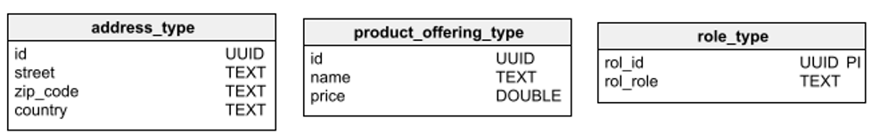
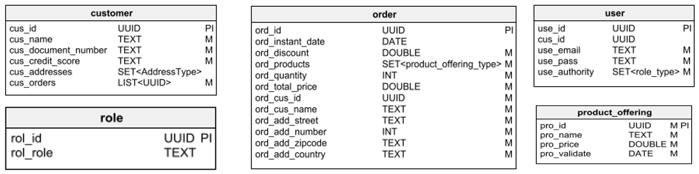
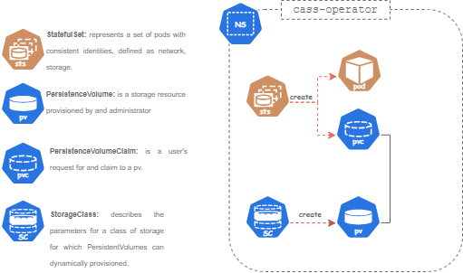

### **Introduction**

This project is a demonstration of how to use Apache Cassandra for building a shopping cart application. The README provides an overview of Apache Cassandra, a comparison with relational databases, an explanation of data modeling in Cassandra, and a description of the project's data model and query-driven approach.

### **Table of Contents**

- [Introduction about Apache Cassandra](#introduction-about-apache-cassandra)
- [Replication ensures reliability and fault tolerance](#replication-ensures-reliability-and-fault-tolerance)
- [Apache Cassandra vs Relational Database](#apache-cassandra-vs-relational-database)
- [Cassandra Data Types](#cassandra-data-types)
- [Cassandra User Defined Type](#cassandra-user-defined-type)
- [Data Modeling](#data-modeling)
- [Query-driven modeling](#query-driven-modeling)
- [Project Model](#project-model)
- [How the service will work?](#how-the-service-will-work)
- [Containers With Cassandra](#containers-with-cassandra)
- [Introducing Cassandara on Kubernetes](#introducing-cassandara-on-kubernetes)
- [Guides that can help you](#guides-that-can-help-you)
- [Conclusions](#conclusions)
- [References](#references)

### **Introduction about Apache Cassandra**

Apache Cassandra is a NoSQL distributed database. By design, NoSQL databases are lightweight, open-source, non-relational, and largely distributed. Counted among their strengths are horizontal scalability, distributed architectures, and a flexible approach to schema definition [\[1\]](#references).

- Cassandra was developed from the flaws of system/hardware that can and does occur.
- Distributed Peer-To-Peer system.
- All nodes are the same.
- Data is partitioned across nodes in the cluster.
- Custom replication to ensure the fault tolerance.
- Read/Write Anywhere between data centers.

All nodes participate in a masterless cluster, meaning there is no primary node. A commit log ensures data durability by monitoring write activities. The data is also written to a memory structure and only flushed to disk when the memory becomes full. Need more capacity? Add a server. Want higher throughput? Add a server [\[2\]](#references).

<figure>
  <div align="center">
    
    <figcaption >Figure 1: Distribution provides power and resilience.</figcaption>
  </div>
</figure>

### **Replication ensures reliability and fault tolerance**
One piece of data can be replicated to multiple (replica) nodes, ensuring reliability and fault tolerance. Cassandra supports the notion of a replication factor (RF), which describes how many copies of your data should exist in the database. So far, our data has only been replicated to one replica (RF = 1). If we up this to a replication factor of two (RF = 2), the data needs to be stored on a second replica as well – and hence each node becomes responsible for a secondary range of tokens, in addition to its primary range. A replication factor of three ensures that there are three nodes (replicas) covering that particular token range, and the data is stored on yet another one [\[3\]](#references).

<figure>
  <div align="center">
    
    <figcaption >Figure 2: Reliability and fault tolerance.</figcaption>
  </div>
</figure>

There are two basic strategies for data partitioning:
- Random partitioning - the default and recommended strategy. The data is partitioned as evenly as possible across the nodes using a HASH code for each row.
- Ordered partitioning - stores the rows in an ordered manner (pre-defined).
In the cassandra.yaml configuration file, it is possible to change the modes in the partitioner option.

### **Apache Cassandra vs Relational Database**
Apache Cassandra and relational databases are database management systems with different approaches. Here are some key differences between Apache Cassandra and a relational database:

- **Data Model**:
    - **Relational Database**: Relational databases follow a structured, table-based data model where data is organized into rows and columns. Tables are defined by fixed schemas, and relationships between tables are established through foreign keys.
    - **Apache Cassandra**: Cassandra adopts a denormalized, column-based data model. Data is stored in column families, where each row can have a variable number of columns. This allows for greater flexibility in data modeling, especially in large-scale scenarios with high availability requirements.

- **Scalability**:
    - **Relational Database**: Relational databases are typically scaled vertically, which means adding more resources (CPU, memory) to a single server to handle increased workload. This approach may have practical limitations in terms of scalability.
    - **Apache Cassandra**: Cassandra was designed for horizontal scalability, allowing the addition of more nodes to the cluster to handle increased workload. It efficiently distributes data across multiple nodes, providing high availability and linearly scalable performance.

- **Consistency and Availability**:
    - **Relational Database**: Relational databases typically follow the ACID (Atomicity, Consistency, Isolation, Durability) model to ensure data consistency. This means that in concurrent transactions, consistency is maintained, but there may be a trade-off in availability.
    - **Apache Cassandra**: Cassandra follows an eventual consistency model, where availability and performance are prioritized over immediate consistency. This enables fast read and write operations even in distributed environments but may result in a period where data is eventually consistent.

- **Geographic Flexibility**:
    - **Relational Database**: Relational databases often have limitations regarding the geographic distribution of data. Data is stored on a single server or replicas within a specific geographic region.
    - **Apache Cassandra**: Cassandra allows data replication across multiple geographically distributed data centers, offering high availability and fault tolerance across different regions. This is particularly useful in applications with global replication needs or serving users in different parts of the world.

These are just a few of the differences between Apache Cassandra and a relational database. The choice between the two depends on specific project requirements, such as scalability, data modeling flexibility, and consistency and availability needs [\[4\]](#references).

### **Cassandra Data Types**
*CQL (Cassandra Query Language)* is a typed language and supports a rich set of data types, including native types, collection types, user-defined types, tuple types, and custom types, there are some examples regarding native types [\[5\]](#references):
<div align="center">
<table style="border-collapse: collapse; border: 1px solid black;">
  <tr>
    <th>Data Type</th>
    <th>Description</th>
  </tr>
  <tr>
    <td>ASCII</td>
    <td>Sequence of ASCII characters</td>
  </tr>
  <tr>
    <td>BIGINT</td>
    <td>64-bit long integer</td>
  </tr>
  <tr>
    <td>BOOLEAN</td>
    <td>Boolean value (true or false)</td>
  </tr>
  <tr>
    <td>DATE</td>
    <td>Date without time or time zone</td>
  </tr>
  <tr>
    <td>DOUBLE</td>
    <td>64-bit floating-point number</td>
  </tr>
  <tr>
    <td>FLOAT</td>
    <td>32-bit floating-point number</td>
  </tr>
  <tr>
    <td>INET</td>
    <td>IPv4 or IPv6 address</td>
  </tr>
  <tr>
    <td>INT</td>
    <td>32-bit integer</td>
  </tr>
  <tr>
    <td>TEXT</td>
    <td>UTF-8 encoded character string</td>
  </tr>
  <tr>
    <td>TIME</td>
    <td>Time value</td>
  </tr>
  <tr>
    <td>TIMESTAMP</td>
    <td>Date and time stamp</td>
  </tr>
  <tr>
    <td>UUID</td>
    <td>Universally unique identifier</td>
  </tr>
  <tr>
    <td>VARINT</td>
    <td>Arbitrary-precision integer</td>
  </tr>
  <tr>
    <td>TIMEUUID</td>
    <td>Universally unique identifier with time</td>
  </tr>
</table>
<br>
Figure 3: Cassandra native types.
</div>

### **Cassandra User Defined Type**
In Cassandra, in addition to primitive data types, it is possible to create User Defined Types (UDTs) to model more complex data structures. UDTs allow grouping related fields into a single entity. Here is an explanation of User Defined Types in Cassandra:
Definition
User Defined Types are created by the user to define a custom data structure. A UDT consists of a set of fields, where each field has a name and an associated data type. UDTs are created at the keyspace level and can be used as data types in table columns [\[6\]](#references).

Let's consider the scenario that we will develop during the project, we have three UDTs:

<figure>
  <div align="center">
    
    <figcaption >Figure 4: User Defined Types.</figcaption>
  </div>
</figure>

CQL support the definition of user-defined types (UDTs). Such a type can be created, modified and removed using the create_type_statement, alter_type_statement and drop_type_statement described below. But once created, a UDT is simply referred to by its name, let’s create and use a UDT:

Using CQL to define UDTs:

```cql
CREATE TYPE address_type (
  id UUID,
  street TEXT,
  addressNumber INT,
  zipCode TEXT,
  country TEXT
);
```

Using Java to define UDTs:

```java
@UserDefinedType("address_type")
@Data
@AllArgsConstructor
@NoArgsConstructor
public class AddressType {

    @CassandraType(type = Name.UUID)
    private UUID id;

    @CassandraType(type = Name.TEXT)
    private String street;

    @CassandraType(type = Name.DOUBLE)
    private Integer addressNumber;

    @CassandraType(type = Name.TEXT)
    private String zipCode;

    @CassandraType(type = Name.TEXT)
    private String country;
    
}
```

### **Data Modelling**
Apache Cassandra stores data in tables, with each table consisting of rows and columns. CQL (Cassandra Query Language) is used to query the data stored in tables. Apache Cassandra data model is based around and optimized for querying. Cassandra does not support relational data modeling intended for relational databases.

Data replication is a key aspect of Cassandra's data model. Replication ensures that copies of data are stored on multiple nodes to provide fault tolerance and high availability. Cassandra uses a distributed consensus protocol called the gossip protocol to ensure that data remains consistent across replicas.

By working without rigid relationships and relying on data replication, Cassandra offers exceptional scalability, fault tolerance, and the ability to handle massive amounts of data. This data model is particularly well-suited for use cases where high availability, read and write performance, and flexible data schemas are crucial, such as real-time analytics, IoT data, and large-scale web applications.

In Cassandra, data modeling is query-driven. The data access patterns and application queries determine the structure and organization of data which then used to design the database tables.

Data is modeled around specific queries. Queries are best designed to access a single table, which implies that all entities involved in a query must be in the same table to make data access (reads) very fast. Data is modeled to best suit a query or a set of queries. A table could have one or more entities as best suits a query. As entities do typically have relationships among them and queries could involve entities with relationships among them, a single entity may be included in multiple tables [\[7\]](#references).

### **Query-driven modeling**
Unlike a relational database model in which queries make use of table joins to get data from multiple tables, joins are not supported in Cassandra so all required fields (columns) must be grouped together in a single table. Since each query is backed by a table, data is duplicated across multiple tables in a process known as denormalization. Data duplication and a high write throughput are used to achieve a high read performance [\[8\]](#references).

### **Project model**

<figure>
  <div align="center">
    
    <figcaption >Figure 5: Shopping Cart model.</figcaption>
  </div>
</figure>

Using CQL to define table "customer":

```cql
CREATE TABLE customer (
  cus_id UUID PRIMARY KEY,
  cus_name TEXT,
  cus_document_number TEXT,
  cus_status TEXT,
  cus_credit_score TEXT,
  cus_addresses SET<frozen<address_type>>,
  cus_orders LIST<UUID>
);
```

Using Java to define table "customer":

```java
@Table(value = "customer")
@Data
public class Customer {

    @Id
    @PrimaryKeyColumn(name = "cus_id", ordinal = 0, type = PrimaryKeyType.PARTITIONED)
    @CassandraType(type = Name.UUID)
    private UUID id;

    @Column("cus_name")
    @CassandraType(type = Name.TEXT)
    private String costumerName;

    @Column("cus_document_number")
    @CassandraType(type = Name.TEXT)
    private String customerDocumentNumber;

    @Column("cus_status")
    @CassandraType(type = Name.TEXT)
    private String customerStatus;

    @Column("cus_credit_score")
    @CassandraType(type = Name.TEXT)
    private String customerCreditScore;

    @Column("cus_addresses")
    @CassandraType(type = Name.SET, typeArguments = { Name.UDT }, userTypeName = "address_type")
    private Set<AddressType> addresses;

    @Column("cus_orders")
    @CassandraType(type = Name.LIST, typeArguments = { Name.UUID })
    private List<UUID> customerOrders;

}
```
*Note that when we need certain information, we simply replicate it and if it is multiple, we remove the atomicity, which makes the reading very fast.*

### **how service will work?**
So we've learned all these things, but how am I going to get the information I need? Who will ensure consistency? Simple, the responsible for consistency is not the database, but the application. For this it is important to know what your queries will be and what the business rules are, let's see a simple example of an order below:

```java
public ResponseEntity<Order> insert(Order order) {
    order.setOrderOfferingId(UUID.randomUUID());
    Customer customer = customerService.getById(order.getCustomerId());
    if (customer == null) {
        return ResponseEntity.notFound().build();
    }
    order.setOrderOfferingInstanDate(LocalDate.now());

    calculateFinalPrice(order);

    orderRepository.save(order);
    updateCustomerWithNewOrder(customer, order);

    return ResponseEntity.ok(order);
}
```
Note that from the created order, an update is made to the customer associated with the order with a new order UUID, which will cause the list of orders for the customer to receive the newest order created by him. The main concept to work with Cassandra is to be aware that consistency problems are solved with business rules, for example, if it is not desired to include a **role** table, we can simply create an Enum, instead of performing a database query to evaluate the created access levels.

### **Containers With Cassandra**

If you want just a single node to test your code and persist some data, you can use the example in the `docker-compose` file, which is running a single Cassandra instance and exposing the ports to use out of the docker network. Remember that if you need to connect your Java application to a instance you need to set the application.yml with the correct contact-point which can be the container ip address, if you're not exposing the instance, or the container name, if you're running your Java application in a docker container in the same database network.

```yaml
version: '3.1'
services:
  mycassandra:
    image: cassandra
    container_name: mycassandra
    ports:
      - "9042:9042" # Default port used for client-to-node communication.
      - "7000:7000" # Default port used for inter-node communication within a Cassandra cluster.
    volumes:
      - cassandra-data:/var/lib/cassandra
volumes:
  cassandra-data:
```

If you want to use a multi-node cluster, you can use the docker-compose file setting the seed node and the worker node.

```yaml
version: '3.1'
services:
  cassandra-seed:
    image: cassandra
    ports:
      - "9042:9042" # Native transport
      - "7199:7199" # JMX
      - "9160:9160" # Thrift clients
    environment:
      - CASSANDRA_SEEDS=cassandra-seed
      - CASSANDRA_CLUSTER_NAME=cassandra-cluster
      - CASSANDRA_PASSWORD_SEEDER=yes
      - CASSANDRA_PASSWORD=cassandra
      - MAX_HEAP_SIZE=2G
      - HEAP_NEWSIZE=200M

  cassandra-node:
    image: cassandra
    environment:
      - CASSANDRA_SEEDS=cassandra-seed
      - CASSANDRA_CLUSTER_NAME=cassandra-cluster
      - CASSANDRA_PASSWORD=cassandra
      - MAX_HEAP_SIZE=2G
      - HEAP_NEWSIZE=200M

    depends_on:
      - "cassandra-seed"
```

After that, you can run `docker-compose -f docker-compose.yml up -d --scale cassandra-node=2` to run a cassandra cluster with two nodes. Note that it can be used to develop the Java application, but it's not good to use in productions, mainly when we're talking about persist data using multi-node cluster. The autor of this repository recommends to use the first `docker-compose` file to develop your own SpringBoot application, test some stuffs with the second, but for data operations, even with a test environment, is better to use e Kubernetes Cassandra Cluster, which we'll see in the next chapter.

### **Introducing Cassandara on Kubernetes**

<figure>
  <div align="center">
    
    <br/>
    <figcaption >Figure 6: Cassandra Operator Storage.</figcaption>
  </div>
</figure>

The image above shows basic storage orchestration by StatefulSet applications, which have persistent operations and Write/Read transactions. In Kubernetes, the object type to use for applications that have state, like databases, is the StatefulSet[\[9\]](#references).

### **Guides that can help you**
- [Build a book tracker app (Spring Boot + Cassandra)](https://www.youtube.com/watch?v=LxVGFBRpEFM&list=PLKY246dKRk4UJ7PmDZGhgczDoLx5bmmXy)
- [Introdução ao Cassandra - Cassandra Day Brasil 2022](https://www.youtube.com/watch?v=iNOjDBpZ-CA)
- [Desenvolvimento de Aplicações - Cassandra Day Brasil 2022](https://www.youtube.com/watch?v=O667L-OiXiY)
- [Introduction to Spring Data Cassandra](https://www.baeldung.com/spring-data-cassandra-tutorial)

### **Conclusions**
Apache Cassandra is an extremely powerful database and if used correctly it is possible to create applications with gigantic availability and scalability, the repository is a simple example of how to perform a ShoppingCart using Cassandra, however the code can and should be improved, suggestions are needed to content improvement. Furthermore, Apache Cassandra contains hundreds of features beyond those shown in the example that can be applied to increase performance.

### **References**

- [1]: [What is Apache Cassandra?](https://cassandra.apache.org/_/cassandra-basics.html)
- [2]: [Want more power? Add more nodes](https://cassandra.apache.org/_/cassandra-basics.html)
- [3]: [Replication ensures reliability and fault tolerance](https://cassandra.apache.org/_/cassandra-basics.html)
- [4]: [Comparative Analysis of Relational and Non-relational Databases in the Context of Performance in Web Applications](https://link.springer.com/chapter/10.1007/978-3-319-58274-0_13)
- [5]: [The Cassandra Query Language (CQL)](https://cassandra.apache.org/doc/latest/cassandra/cql/index.html)
- [6]: [User-Defined Types (UDTs)](https://cassandra.apache.org/doc/3.11/cassandra/cql/types.html#udts)
- [7]: [What is Data Modeling?](https://cassandra.apache.org/doc/latest/cassandra/data_modeling/intro.html)
- [8]: [Query-driven modeling](https://cassandra.apache.org/doc/latest/cassandra/data_modeling/intro.html)
- [9]: [Using StatefulSets](https://kubernetes.io/docs/concepts/workloads/controllers/statefulset/)
